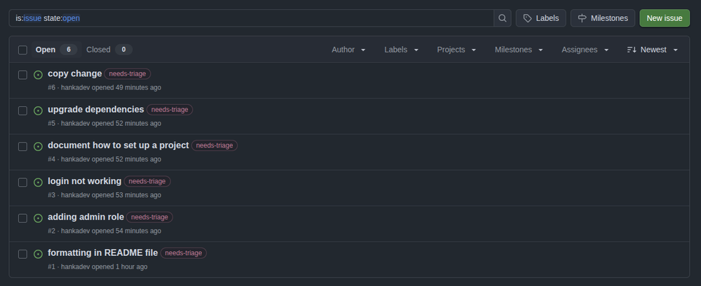
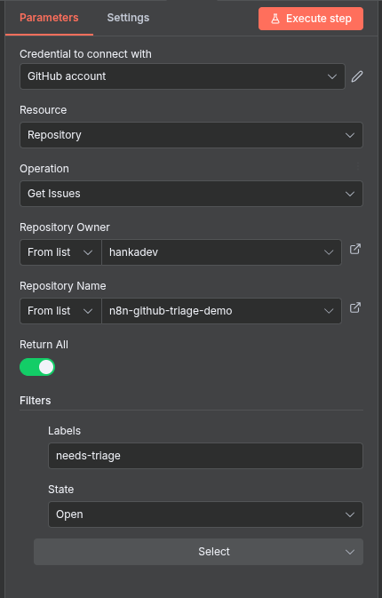
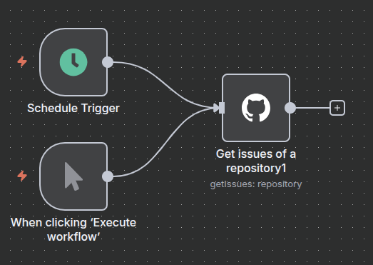
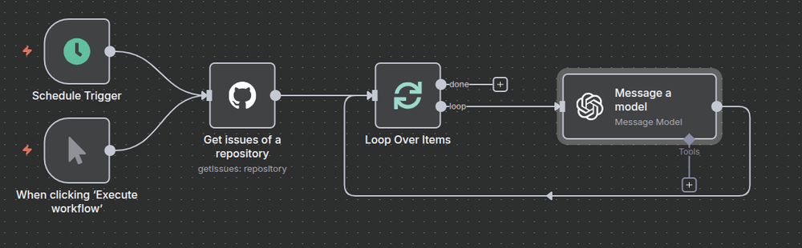
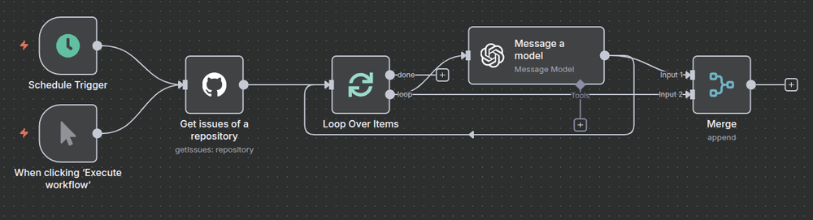
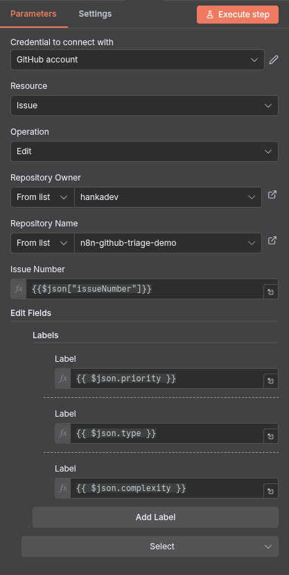
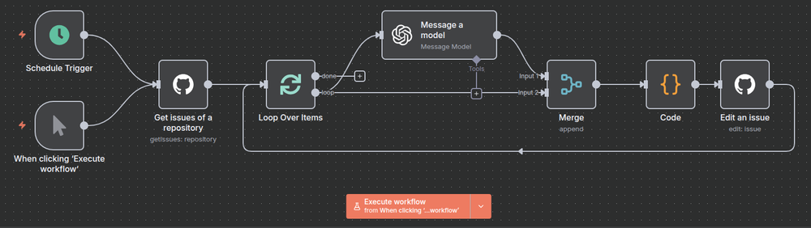
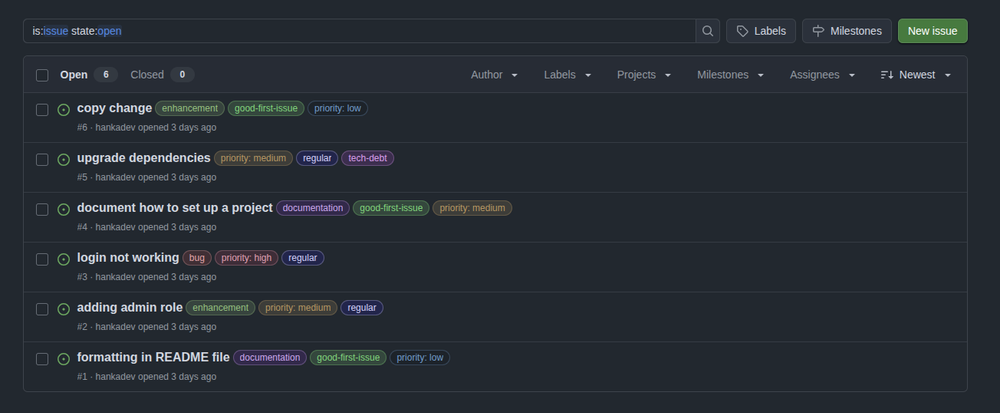

When I first read the now famous [tweet from Joanna Maciejewska](https://x.com/AuthorJMac/status/1773679197631701238?lang=en)

> I want AI to do my laundry and dishes so that I can do art and writing, not for AI to do my art and writing so that I can do my laundry and dishes.

I could not agree more. I love writing code and I do not want AI to take over what I enjoy so much. But I would like AI to do the boring stuff that is part of a developer’s day-to-day life. If you know me, then you probably know that I like to keep the number of meetings to a bare minimum, and I do not like spending a lot of time on triage, planning, and retrospectives. So when I first heard about the [n8n automation tool](https://n8n.io/), my immediate thought was to see if it could handle GitHub issue triage, using AI to do the thinking part.

TL;DR: Yes, it can and it is easy to set up. 😎

## What is n8n

n8n is an open-source workflow automation tool that lets you wire up APIs and services without spending hours reinventing the wheel. It has built-in nodes for things like GitHub, Slack, Jira, Google Drive, Notion, and many, many more, but you can also drop down to raw HTTP requests or custom functions when you need control or something custom. It lets you automate things quickly, so you don’t waste hours writing all the code yourself.

Plus, n8n comes with an intuitive drag-and-drop interface that makes the whole process even easier and more straightforward. You can visually design workflows, connect nodes with a simple drag, and see exactly how the entire workflow looks.

## The plan

Let’s first lay down the overall plan and then elaborate more on each step once we get there.

- Set up n8n locally.
- Create a GitHub repository and prepare some issues.
- Create the workflow logic
  - Fetch all GitHub issues that need triaging.
  - Send a prompt to AI for each issue with detailed instructions on how to perform the triage and what data to extract (labels and summary).
  - Update each GitHub issue with the labels and summary returned by the AI.

## Setting up n8n

Getting started is straightforward with the [official documentation](https://docs.n8n.io/choose-n8n/) on how to get started. You can use [n8n Cloud](https://docs.n8n.io/manage-cloud/overview/) (they offer a free tier) or run a self-hosted version. If you just want to experiment, I recommend the self-hosted option: pull the Docker image and run it locally. Later, if you decide to deploy it more seriously, the documentation covers Docker Compose and Kubernetes setups.

## Setting up GitHub repository

First we will need to create a GitHub repository and several issues so we can test the idea. I created a [demo repository](https://github.com/hankadev/n8n-github-triage-demo) with 6 issues. My idea was that when the issue is created, it will get the `needs-triage` label (this part is handled by GitHub workflow and it is part of the repository), so the automation can target only those and we do not triage the same issues multiple times.

Since I am now just trying to verify my idea, I kept the issue description minimal and just made sure that they are diverse.



After the automated triage I want to sort my issues and assign to each a type, priority and complexity label.

- type: `bug`, `enhancement`, `question`, `documentation` or `tech-debt`
- priority: `priority: high`, `priority: medium` or `priority: low`
- complexity: `good-first-issue`, `regular` or `complex`

The automation flow will be:

1. get all GitHub issues with needs-triage label
2. let AI analyze them and assign labels and generate a short summary of the issue
3. update the labels on GitHub

You will need to create a GitHub Personal Access Token with repo permissions (the token needs to be able to read and update issues) and and API token for the AI node - I will use OpenAI.

So let’s start building it up!

## Workflow Trigger

There is a `Schedule Trigger` node that allows us to schedule an execution daily, weekly, etc. I decided to also use `When clicking 'Execute workflow'` trigger node so I can test the flow easily.

## Fetching Issues from GitHub

The next step is fetching issues from GitHub with the `needs-triage` label. Luckily n8n has already build-in GitHub integration, so just search for GitHub and then select Get issues of a repository. My node configuration looks like this:



And we just connect the node to the trigger(s).



## Triage Logic Implementation

The GitHub node returns all the issues, so now we need to configure the workflow so it:

- loops through the items
- for every item it uses the AI to do the triage
- update the labels on GitHub

So let’s first add the `Loop over Items` node and set the batch size to 1 (because we will be handling items one by one). And after our loop node we connect the Open AI `Message a model` node. Select your API key and which model you want to use (I used the GPT-5 model).

The most important part is the prompt. Here is the prompt I used - at the end you can see me passing the actual `title` and `body` of the issue we are currently looping.

```
You are a GitHub triage assistant.
Given the title and body of a new issue, return a JSON object with the following keys:

{
  "type": "bug | enhancement | question | documentation | tech-debt",
  "priority": "priority: high | priority: medium | priority: low",
  "complexity": "good-first-issue | regular | complex",
  "summary": "<short summary of the issue in less than 50 words>"
}

Rules:
1. Type classification:
   - "bug" = broken functionality.
   - "enhancement" = feature request or improvement.
   - "question" = user inquiry or clarification.
   - "documentation" = docs-related issue.
   - "tech-debt" = refactoring, internal cleanup, maintenance tasks.
2. Priority classification:
   - High = critical or urgent.
   - Medium = important but not urgent.
   - Low = minor, trivial, or cosmetic.
3. Complexity classification:
   - "good-first-issue" = simple, well-defined, easy for a new contributor (e.g., styling, copy changes, small fixes). Priority is NOT high.
   - "regular" = standard issue that requires some experience or understanding of the codebase.
   - "complex" = difficult issue, may involve multiple components, advanced knowledge, or high-risk changes.
4. Summary should be concise (<50 words).
5. Return valid JSON ONLY, no extra text.

Example input:
Title: "Fix typo in README"
Body: "There's a small typo in the installation instructions."

Example output:
{
  "type": "documentation",
  "priority": "priority: low",
  "complexity": "good-first-issue",
  "summary": "Correct typo in README installation instructions."
}

Now classify this issue:
Title: {{$json["title"]}}
Body: {{$json["body"]}}
```

💡Tip: Don’t be afraid to use an AI tool to help you generate the prompt itself.

So our flow now looks like this:



Now we come to the more technical part. The AI node returns only the labels and summary for each issue, but in order to be able to edit the issue we will also need the issue number. Luckily n8n has a Merge node which enables us to merge data from multiple nodes. When adding the merge node, we can choose how we want the merge to happen. Since our data source has no common fields we will use the append mode and 2 inputs. And we connect our AI and our Loop nodes as the inputs.



Now we successfully merged the data from GitHub and the data from AI and we are ready for the next step.

Next we need to access the data from both sources and we will do it by using the Code node. This is a very powerful node because we can write any custom logic we want. For demo purposes we will keep it simple and we will just extract and return the final data we need by adding this simple JavaScript code:

```js
const data = $input.all();

const aiResponse = data[0].json.message.content;
const loopItemData = data[1].json;

return [
  {
    json: {
      issueNumber: loopItemData.number,
      type: aiResponse.type || "",
      priority: aiResponse.priority || "",
      complexity: aiResponse.complexity || "",
      summary: aiResponse.summary || "",
    },
  },
];
```

And the last step will be adding the GitHub node, but this time it will be Edit an issue node. And we can configure this node to use the issue number and labels we returned from previous node to update the item.



Final workflow looks like this:



Now we only need to trigger the flow and check the result on GitHub. It really did a good job and did the triage the same way I would do it myself. Of course in real world and with way too many issues we may need to tweak the prompt, but I am pretty confident that this would work very well in production settings as well.



## Conclusion

I have to say, I am impressed by what n8n can do. Most of the heavy lifting is covered by built-in integrations with tools like GitHub, Slack, Jira, Google Drive, Notion, and more, making automation fast and simple. For anything the built-in nodes don’t cover, the Code block lets you write custom logic, call APIs directly, or manipulate data however you need.

The UI for building workflows is intuitive, so prototyping solutions is quick and straightforward. And if you don’t want to start from scratch, n8n offers [pre-built workflow templates](https://n8n.io/workflows/) that can be just simply customized to your needs. You can even [build your own custom nodes](https://docs.n8n.io/integrations/creating-nodes/overview/) to extend n8n’s functionality beyond what’s available out of the box.

Some ideas of what can be automated:

- Slack/Discord notification when a PR is created or merge
- PR review notifications
- Pulling data from multiple sources and creating reports
- Pulling RSS feed and create a newsletter
- Onboarding new employees - automatically create accounts and even assign first JIRA or GitHub tasks based on labels/priorities

In the end, there are no limits except your own imagination.
