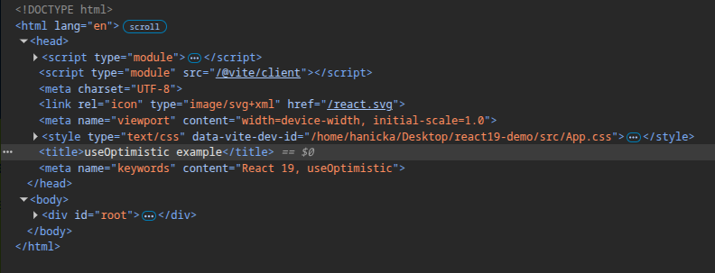

React 19 has been around for a while (the stable RC candidate was released in December 2024), but it still seems to be flying under the radar. Most developers I talk to either aren’t familiar with the new features or haven’t bothered upgrading yet. One area where the changes really stand out is form handling. Forms are one of the most tedious parts of building a web app - juggling pending state, tracking errors, and maybe even throwing in an optimistic update if you’re feeling fancy. Sounds simple, but without a third-party library, it rarely is.

The best way to understand the changes is to dive into the code itself. Let’s have a look at a demo app, you can find the source code on [GitHub](https://github.com/hankadev/react19-demo). It is just a simple app with a form. For simplicity, we’re using local state and a short delay to mimic how a backend would respond. In a real app, you would be calling an actual API or, in a framework like Next.js, you would be using server actions.

The first example is the React 18 one - it means we need to handle the state for the form inputs, the form pending state and also the errors. Quite a lot of work that we need to write over and over again for every single form.

```jsx
const Form: React.FC<FormProps> = ({ createReminder }) => {
  const [title, setTitle] = useState<string>("");
  const [description, setDescription] = useState<string>("");
  const [isPending, setIsPending] = useState<boolean>(false);
  const [error, setError] = useState<string>("");

  const handleSubmit = async (e: FormEvent<HTMLFormElement>) => {
    e.preventDefault();

    setIsPending(true);
    const result = await createReminder(title, description);
    setIsPending(false);

    if (result?.error) {
      setError(result.error);
      return;
    }

    setTitle("");
    setDescription("");
  };

  return (
    <form autoComplete="off" onSubmit={handleSubmit}>
      <p className="error-text">{error}</p>

      <label htmlFor="title">Title</label>
      <input
        type="text"
        name="title"
        disabled={isPending}
        value={title}
        onChange={e => setTitle(e.target.value)}
      />
      <label htmlFor="description">Description</label>

      <textarea
        name="description"
        rows={5}
        disabled={isPending}
        value={description}
        onChange={e => setDescription(e.target.value)}
      />
      <button type="submit" className="create-button" disabled={isPending}>
        {isPending ? "Creating..." : "Create"}
      </button>
    </form>
  );
};
```

## [useTransition](https://react.dev/reference/react/useTransition)

Now let’s have a look at how we can simplify the code using one of React 19’s new hooks - the `useTransition` hook. This hook defers low-priority state updates. Simply wrap them in `startTransition()`, and React treats them as non-urgent. Why? Complex updates can block the main thread, making the UI unresponsive and impacting user experience. When using a transition, React schedules and prioritizes rendering so the UI stays responsive, even if other state changes are happening.

Moreover the hook also keeps track of whether the transition is ongoing.

We can use it to simplify our form implementation, but it also has other use cases - if you need logic for switching tabs or filtering/searching a long list, `useTransition` can do the job.

```jsx
const Form: React.FC<FormProps> = ({ createReminder }) => {
  const [title, setTitle] = useState<string>("");
  const [description, setDescription] = useState<string>("");
  const [error, setError] = useState<string>("");

  const [isPending, startTransition] = useTransition();

  const handleSubmit = async () => {
    startTransition(async () => {
      const error = await createReminder(title, description);
      if (error?.error) {
        setError(error.error);
        return;
      }
      setTitle("");
      setDescription("");
    });
  };

  return (
    <form autoComplete="off" action={handleSubmit}>
      <p className="error-text">{error}</p>

      <label htmlFor="title">Title</label>
      <input
        type="text"
        name="title"
        disabled={isPending}
        value={title}
        onChange={e => setTitle(e.target.value)}
      />
      <label htmlFor="description">Description</label>

      <textarea
        name="description"
        rows={5}
        disabled={isPending}
        value={description}
        onChange={e => setDescription(e.target.value)}
      />
      <button type="submit" className="create-button" disabled={isPending}>
        {isPending ? "Creating..." : "Create"}
      </button>
    </form>
  );
};
```

## [useActionState](https://react.dev/reference/react/useActionState)

But what if we want just a simple way of handling form and we want to get rid of handling the state? In that case, we can use the `useActionState` hook.

This hook returns 3 values:

- The first one is the result we get from our “backend“- in our case, the `error` value.
- The `submitAction`, which we can pass to the `form` component.
- The `isPending` state.

It also gives us access to `previousState` and `formData`. The `formData` can be used to extract the values from input. The `previousState` can be handy for example in case we need to calculate some value based on its previous state or we need to compare the previous and current values.

```jsx
const Form: React.FC<FormProps> = ({ createReminder }) => {
  const [error, submitAction, isPending] = useActionState(
    async (previousState, formData) => {
      const title = formData.get("title");
      const description = formData.get("description");

      const error = await createReminder(title, description);

      if (error) {
        return error;
      }

      // any logic for the successful submission
      return null;
    },
    null,
  );

  return (
    <form autoComplete="off" action={submitAction}>
      <p className="error-text">{error?.error}</p>

      <label htmlFor="title">Title</label>
      <input type="text" name="title" disabled={isPending} />

      <label htmlFor="description">Description</label>
      <textarea name="description" rows={5} disabled={isPending} />

      <button type="submit" className="create-button" disabled={isPending}>
        {isPending ? "Creating..." : "Create"}
      </button>
    </form>
  );
};
```

## [useOptimistic](https://react.dev/reference/react/useOptimistic)

Now we have a very simple and elegant way to handle a form, but let’s take it even one step further by adding an optimistic update. We can leave the form implementation as it is, and add the logic for updating the UI in an optimistic way just to the parent component. And it is easier than you might assume.

The `useOptimistic` hook takes the state and function to update the state as arguments and it will return to us the state value and a function we can use to add an item to the state before we trigger the actual function that saves the data.

This way the UI presents the data to the user immediately and in case there is an error, the value will be removed. If you ever tried to implement this yourself, I am sure you really like this new simple way.

```jsx
const UseOptimisticPage = ({ reminders, createReminder }) => {
  const [optimisticReminders, addOptimisticReminder] = useOptimistic(
    reminders,
    (state, newReminder) => [...state, { ...newReminder, isPending: true }],
  );

  const createReminderOptimistic = async (title, description) => {
    const optimisticReminder = {
      id: Date.now(),
      title: title.trim(),
      description: description.trim(),
    };

    addOptimisticReminder(optimisticReminder);

    return await createReminder(title, description);
  };

  return (
    <>
      <RemindersList reminders={optimisticReminders} />
      <FormUseActionState createReminder={createReminderOptimistic} />
    </>
  );
};
```

React 19 is not only introducing improvements in form handling, but much more. Let’s have a look at some changes that may seem small, but I found them very handy.

## [useFormStatus](https://react.dev/reference/react-dom/hooks/useFormStatus)

If you’re using a reusable button for your forms, you will definitely appreciate the new `useFormStatus` hook.

How does it work? It finds the parent `form` component and returns the pending status of the last form submission (basically whether the form is currently being submitted).

```jsx
import { useFormStatus } from "react-dom";

function Button() {
  const { pending } = useFormStatus();
  return <button type="submit" disabled={pending} />;
}
```

## [use API](https://react.dev/reference/react/use)

Have you ever wished you could read a context or a promise inside of a component conditionally? If so, this new API (yep, it is an API, not a hook) allows you to do so.

```jsx
function MyComponent = ({ data }) => {
	if(data.length > 0) {
		return null;
	}

	const theme = use(ThemeContext);
}
```

The `use` API enables us also read a promise - and React will automatically suspend until the promise is resolved. So it works well together with `Suspense` and `Error` boundaries.

In this example we have a `promise` function that loads data. Until the promise is resolved and the data are loaded, the UI will show the `Suspense` boundary.

```jsx
const Page = ({ promiseFn }) => (
  <Suspense fallback={<div>Loading...</div>}>
    <Comments promiseFn={promiseFn} />
  </Suspense>
);

const Component = ({ promiseFn }) => {
  const data = use(promiseFn);
  return data.map((item) => <Item item={item} />);
};
```

## [Metadata support](https://react.dev/reference/react-dom/components#resource-and-metadata-components)

You can define `title`, `link` and `meta` directly in your components and they will be hoisted and injected to the `head` element. This improves the SEO of the application and removes the need of a third party library (like `react-helmet`). But in case you have a more advanced scenario, you may still need a library.

```jsx
const UseOptimisticPage = ({ reminders, createReminder }) => {
  // page logic

  return (
    <>
      <title>useOptimistic example</title>
      <meta name="keywords" content="React 19, useOptimistic" />
      <RemindersList reminders={optimisticReminders} />
      <FormUseActionState createReminder={createReminderOptimistic} />
    </>
  );
};
```



## [Stylesheets](https://react.dev/reference/react-dom/components/link)

In case of SSR (server side rendering) `<link>` tags are included in the `<head>` so the browser will not paint the UI until the the stylesheet is loaded.

In case of CSR (client side rendering) React will wait until the stylesheet is loaded before committing a render.

## [ref improvements](https://react.dev/blog/2024/12/05/react-19#ref-as-a-prop)

ref can be passed as prop, no need for `forwardRef`.

```jsx
const Input = ({ ref, ...props }) => <input ref={ref} {...props} />;
```

We can also now specify the cleanup function that executes when the element is removed from DOM.

```jsx
const Input = ({ ref, ...props }) => (
  <input
    ref={(element) => {
      return () => {
        // cleanup
      };
    }}
    {...props}
  />
);
```

## [Context as Provider](https://react.dev/blog/2024/12/05/react-19#context-as-a-provider)

You can render just `<Context>` instead of `<Context.Provider>`.

```jsx
const ThemeContext = createContext("");

const App = ({ children }) => (
  <ThemeContext value="dark">{children}</ThemeContext>
);
```

## Conclusion

Those are the features and improvements that caught my eye the most. There’s much more to explore - from [Server Component](https://react.dev/reference/rsc/server-components) and [Server functions](https://react.dev/reference/rsc/server-functions) to the new [React Compiler](https://react.dev/blog/2025/04/21/react-compiler-rc).

You probably won’t use Server Actions or Server Components on their own, because they aren’t designed to be standalone features in plain React apps. They rely on framework-level tooling (like Next.js or React Router) for routing, data fetching, and bundling. Without that integration, you can’t easily run them in production.

I hope you found your favorites too and that your next application will be built with React 19. If you’re planning an upgrade, the [official guide](https://react.dev/blog/2024/04/25/react-19-upgrade-guide) is the best place to start.

React 19 isn’t just an update - it’s a shift in how we write React apps. Better stay ahead of the curve.
